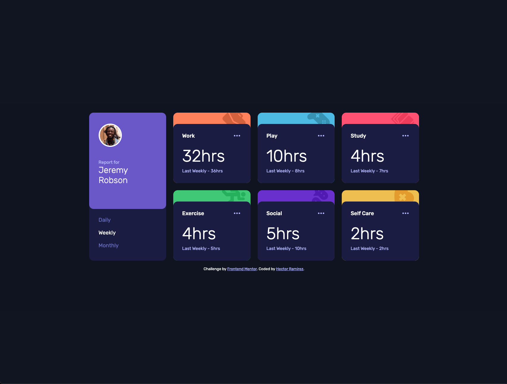
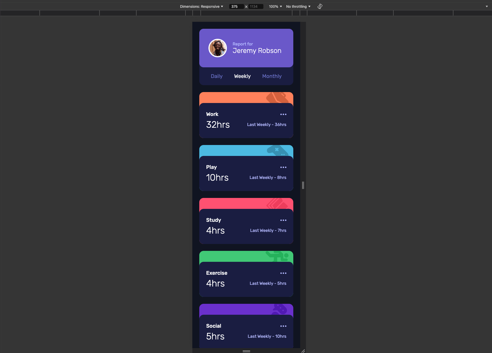

# Frontend Mentor - Time tracking dashboard solution

This is a solution to the [Time tracking dashboard challenge on Frontend Mentor](https://www.frontendmentor.io/challenges/time-tracking-dashboard-UIQ7167Jw). Frontend Mentor challenges help you improve your coding skills by building realistic projects.

## Table of contents

- [Overview](#overview)
  - [The challenge](#the-challenge)
  - [Screenshot](#screenshot)
  - [Links](#links)
- [My process](#my-process)
  - [Built with](#built-with)
  - [What I learned](#what-i-learned)
  - [Continued development](#continued-development)
  - [Useful resources](#useful-resources)
- [Author](#author)

## Overview

### The challenge

Users should be able to:

- View the optimal layout for the site depending on their device's screen size
- See hover states for all interactive elements on the page
- Switch between viewing Daily, Weekly, and Monthly stats

### Screenshot




### Links

- Solution URL: [Solution URL here](https://github.com/hectorlil48/time-tracking-dashboard-main)
- Live Site URL: [Live site URL here](https://hectorlil48.github.io/time-tracking-dashboard-main/)

## My process

### Built with

- Semantic HTML5 markup
- CSS custom properties
- Flexbox
- CSS Grid
- Mobile-first workflow
- JavaScript

### What I learned

I had a hard time doing this project. From getting my background images positioned correctly to figuring out how to write JavaScript to update the hours depending on which button was clicked. One of the things I learned in CSS was to use :where to add an effect when something is hovered over or is active and focused within. It is easier to use that instead of making different classes for hover, active, or focus states. In JavaScript, I learned to fetch data from a JSON file and update my content depending on what was needed.

```css
.btn:where(.active, :hover, :focus-within) {
  color: var(--white);
}
```

```js
async function fetchDataAndUpdateCards(timeframe) {
  try {
    // Fetch the JSON data
    const response = await fetch("data.json");
    const data = await response.json();

    // Update the cards based on the selected timeframe
    updateCards(data, timeframe);
  } catch (error) {
    console.error("Error fetching the data:", error);
  }
}
```

### Continued development

I want to keep using new CSS styles to get better at using CSS. I also want to use JavaScript more and see what I can do with JavaScript.

### Useful resources

- [MDN](https://developer.mozilla.org/en-US/) - MDN is always useful. I was able to get a refresher of the display grid. I learned how to set up my columns and rows.
- [Google](https://www.google.com) - Google is helpful in many ways. I usually ask Google how to do something and it returns many links to help me. It also has a good AI feature that returns good answers.

## Author

- GitHub - [Hector Ramirez](https://github.com/hectorlil48)
- Frontend Mentor - [@hectorlil48](https://www.frontendmentor.io/profile/hectorlil48)
- LinkedIn - [@linkedin.com/in/hector-ramirez-6a6509170](https://www.linkedin.com/in/hector-ramirez-6a6509170/overlay/contact-info/)
